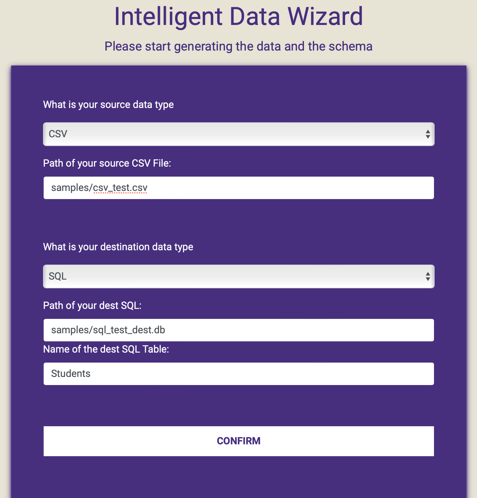

# Intelligent Data Advisor

Capstone Project of ECE@UW, sponsored by Nintex.

Author: Chengyang Gong, Xiaotian Fang, Yuxuan Li.

Advisor: Nick Benjamin, Randy Grohs.

Project Duration: Feb 2022 - Jun 2022.

The Architecture of our code can be shown in:

|           |
|  :-----------------------------------------------------:  |
|                      Architecture                         |

## Start

The project is built on Python3, and for the web app, we use Django as the framework.

To set up environment:
```Shell
git clone git@github.com:x1aotian/Schema_Wizard.git
conda create -y -n SchemaWizard python=3.8
conda activate SchemaWizard

pip install -r requirement.txt
```

Run script version:
```Shell
python main.py
```

Run command line version:
```Shell
python main_cml.py
```

Run the Web App version:
```Shell
python manage.py runserver
```
then you can check the web app on the local server: http://127.0.0.1:8000/original_view/

|           |
|   :----------------------------------------------:  |
|             Screenshot of the Web App               |